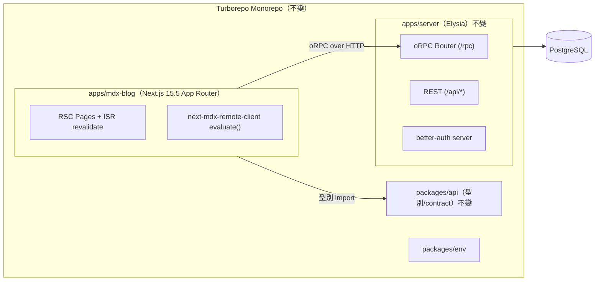
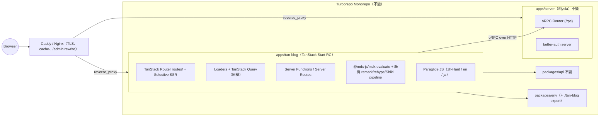
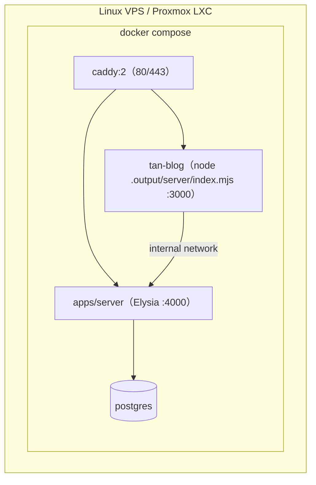
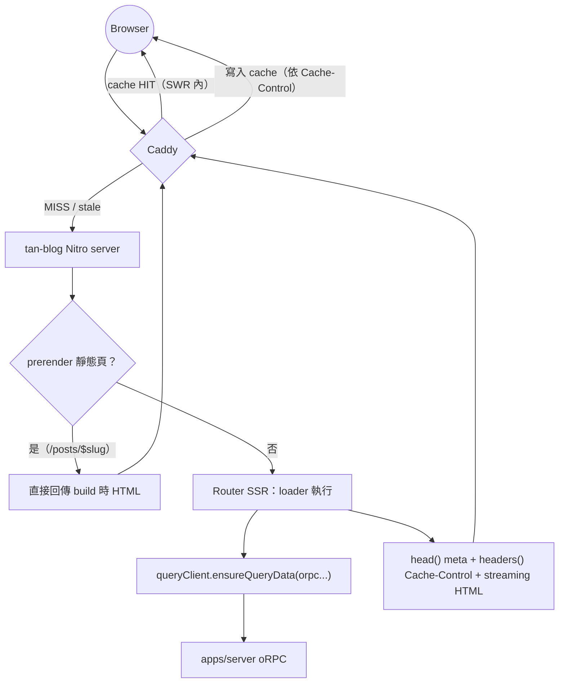
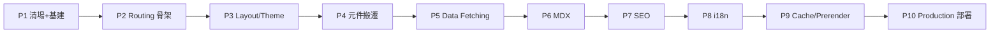

# Technical Design Document：`apps/mdx-blog`（Next.js）→ `apps/tan-blog`（TanStack Start）遷移

> 版本：1.0（2026-07-29）
> 範圍：僅遷移 `apps/mdx-blog` → `apps/tan-blog`。不動 Monorepo 結構、Turborepo Pipeline、CI/CD、其他 packages（唯一例外：`packages/env` 新增 `@sao-blog/env/tan-blog` export，見 ADR-006）。
> 部署目標：Docker Compose + Linux Server（VPS / Proxmox LXC）+ Nginx/Caddy Reverse Proxy，Self-Hosted。不使用 Vercel / Cloudflare。
>
> 標示說明：✅ 官方推薦（Official Recommendation）｜⭐ 社群最佳實踐（Community Best Practice）｜⚠️ 已棄用（Deprecated）｜🚧 實驗性（Experimental）

---

## 目錄

1. [現況與目標架構](#0-現況與目標架構)
2. [第一部分：專案分析](#第一部分專案分析)
3. [第二部分：Dependency Migration](#第二部分dependency-migration)
4. [第三部分：API Mapping](#第三部分api-mapping)
5. [第四部分：Routing Mapping](#第四部分routing-mapping)
6. [第五部分：Rendering](#第五部分rendering)
7. [第六部分：MDX](#第六部分mdx)
8. [第七部分：i18n](#第七部分i18n)
9. [第八部分：SEO](#第八部分seo)
10. [第九部分：Migration Plan（Phase 1–10）](#第九部分migration-plan)
11. [第十部分：Migration Risk](#第十部分migration-risk)
12. [第十一部分：最佳實踐](#第十一部分最佳實踐)
13. [Migration Timeline](#migration-timeline)
14. [ADR（Architecture Decision Records）](#adr)
15. [最終推薦方案](#最終推薦方案)
16. [Sources](#sources)

---

## 0. 現況與目標架構

### TanStack Start 現況（2026-07）

TanStack Start 目前為 **Release Candidate**（feature-complete、API stable）✅，建構於 TanStack Router + Vite（或 Rsbuild）+ Nitro 之上。核心能力：full-document SSR、Streaming、Selective SSR、build-time prerender（SSG）、Server Functions、Server Routes、composable Middleware、100% type-safe routing。

**沒有的東西**（與 Next.js 相比）：內建 image optimization、內建 font optimization、runtime ISR（背景再生）、PPR（Partial Prerendering）、RSC（React Server Components — Start 是「同構 SPA + SSR」模型，所有元件都是 client component，server-only 邏輯走 Server Function / loader）。

### 現況架構



### 目標架構



**部署拓撲（Docker Compose）**：



---

## 第一部分：專案分析

以下依 **實際盤點結果**（非泛用清單）分類。mdx-blog 的重要事實：

- 文章/筆記內容 **來自 `apps/server` 的 oRPC API（MDX 字串）**，不是檔案系統。
- 使用 `next-mdx-remote-client@2` 的 `evaluate()`（RSC path）於 request/build 時編譯 MDX。
- 6 個頁面使用 `export const revalidate`（ISR：60/300/3600 秒），3 個 `generateStaticParams`，1 個 revalidate webhook（`app/api/revalidate/route.ts`）。
- **沒有** i18n、sitemap、robots、RSS、OG image、JSON-LD、canonical、middleware、error.tsx、not-found.tsx、parallel/intercepting routes、cookies()、draftMode、revalidateTag。

### 1.1 可以直接沿用（搬檔 + 改 import 即可）

| 項目 | 說明 |
|---|---|
| 全部 remark/rehype plugins | `remark-gfm`、`remark-breaks`、`remark-math`、`remark-flexible-toc`、`rehype-katex`、`rehype-slug` — unified 生態與框架無關 |
| 自製 Shiki pipeline | `src/components/mdx/parsers.ts`（fine-grained bundle、34 語言、github-light/dark、colorized-brackets、meta-highlight、mermaid/echarts fence 跳過）— 純 unified plugin，直接搬 |
| MDX 元件庫 | `src/components/mdx/renderers/*`（Alert、Accordion、Tabs、Carousel、Progress、Benchmark、CustomQuote、Mermaid、Echarts、Count…）— 純 React，僅 `image.tsx`（next/image）與 `link.tsx`（next/link）需改 |
| 40 個 shadcn/ui 元件 | `src/components/ui/*` — Radix + Tailwind，框架無關 |
| zustand stores ×7、hooks ×6、config | `src/store/*`、`src/hooks/*`、`src/config/*` |
| TanStack Query | 已是 v5，Start 與 Query 官方整合（`@tanstack/react-router-ssr-query` 已在 tan-blog 腳手架）✅ |
| oRPC client | `src/lib/orpc.ts` — `RPCLink` + `createTanstackQueryUtils`，框架無關；SSR 時需補 headers 轉發策略（見 3.x） |
| `src/lib/with-retry.ts` | prerender 期間的網路抖動保護，同樣適用 |
| Tailwind v4（CSS-first） | `globals.css` 的 `@theme` token、typography plugin、`tw-animate-css` — tan-blog 腳手架已用 `@tailwindcss/vite` ✅ |
| motion、mermaid、echarts、katex、sonner、cmdk、vaul、embla… | 純 client 套件 |
| better-auth client | `createAuthClient` 指向 `apps/server`，框架無關 |

### 1.2 必須重寫（有對等概念，寫法不同）

| Next.js | TanStack Start 寫法 |
|---|---|
| `app/layout.tsx`（root layout + html/head） | `src/routes/__root.tsx` + `head()` + `<HeadContent />` + `<Scripts />` |
| `(blog)/layout.tsx` 等 nested layout | pathless layout route（`_blog.tsx` 或 `(blog)/route.tsx` 群組） |
| 各 `page.tsx`（RSC + `revalidate`） | `createFileRoute` + `loader`（Query `ensureQueryData`）+ route `headers()`（Cache-Control SWR） |
| `generateMetadata` ×2 | route `head({ loaderData })` |
| `generateStaticParams` ×3 | vite plugin `prerender.pages` / `routes` + `crawlLinks` ✅ |
| `app/api/revalidate/route.ts` | server route `server.handlers.POST` → 改為 proxy cache purge（見第五部分） |
| Server Action（`preview-action.ts`） | `createServerFn()`（順帶解掉 memory 中記錄的 oRPC-in-Server-Action content-length 問題，因為不再經過 Next Server Action 通道） |
| `next/navigation` hooks（~15 檔） | `useRouter`/`useNavigate`/`useLocation`/`Route.useParams`/`Route.useSearch` |
| `next/link`（~15 檔） | `@tanstack/react-router` `<Link to>`（typed） |
| `loading.tsx`（posts/[slug]） | route `pendingComponent` |
| next-themes ThemeProvider | shadcn 官方 TanStack Start 方案：自製 ThemeProvider + `ScriptOnce` inline script + localStorage ✅（next-themes 不適用於非 Next 環境） |
| `next.config.ts` rewrites（`/admin` → blog-admin.sao-x.com） | 移到 Caddy/Nginx reverse proxy 層（見第十一部分） |
| `@sao-blog/env/web`（`@t3-oss/env-nextjs`、`NEXT_PUBLIC_*`） | 新增 `@sao-blog/env/tan-blog`（`@t3-oss/env-core`、`VITE_*` prefix、`import.meta.env`） |

### 1.3 TanStack Start 沒有（本專案有用到 / 使用者點名）

| 功能 | 狀態 | 說明 |
|---|---|---|
| ISR（runtime 背景再生） | ❌ 無 | Next 的 `revalidate = 60` 是 serverful runtime cache。Start 官方 ISR guide ✅ 的替代：`Cache-Control: public, max-age, stale-while-revalidate` + CDN/proxy cache。self-hosted 由 Caddy/Nginx cache 承接 |
| `revalidatePath` / `revalidateTag` | ❌ 無 | 替代：proxy cache purge（Nginx `proxy_cache_purge` / Caddy cache-handler purge API）或接受 short-TTL SWR |
| RSC / Server Components | ❌ 無 | Start 為同構模型；server-only 程式碼放 loader / Server Function / server route。`server-only` import 需改 `createServerFn` 邊界 🚧（RSC 支援在 Start roadmap 上為實驗方向） |
| `next/image`（runtime 圖片最佳化） | ❌ 無內建 | ⭐ `@unpic/react`（CDN-based）或 build-time 預壓（sharp）。本案僅 1 處（MDX image renderer），改 `` 即可 |
| `next/font` | ❌ 無 | 決策：**直接移除**（不引替代）。目前 Geist 僅裝飾性，改 system font stack |
| `draftMode()` | ❌ 無 | 本案未用。需要時以 cookie + Server Function 自行實作 |
| PPR（Partial Prerendering） | ❌ 無 | Next 亦僅 🚧；Start 以 Selective SSR + Streaming 覆蓋大部分場景 |
| Middleware（edge 檔案慣例 `middleware.ts`） | 概念不同 | Start 的 `createMiddleware()` 更強：request-level + server-function-level 可組合 ✅。本案原本就沒有 middleware |
| Metadata file conventions（`opengraph-image.tsx`、`icon.tsx`…） | ❌ 無 | 靜態檔放 `public/`；動態 OG image 用 server route + `@vercel/og`/satori ⭐ |

### 1.4 TanStack Start 的替代方案總覽

| Next.js 概念 | Start 替代 | 標示 |
|---|---|---|
| RSC data fetching | route `loader` + TanStack Query `ensureQueryData`（SSR dehydrate/hydrate 自動） | ✅ |
| ISR | prerender（SSG）+ `headers()` SWR + proxy cache | ✅ 官方 ISR guide |
| Server Action | `createServerFn().validator().middleware().handler()` | ✅ |
| Route Handler | `createFileRoute` 的 `server: { middleware, handlers: { GET, POST, ... } }` | ✅（新版統一 API；舊 `createServerFileRoute` 已被取代 ⚠️） |
| Metadata API | route `head: () => ({ meta, links, scripts, styles })` + `<HeadContent />` | ✅ |
| `sitemap.ts` | vite plugin `sitemap: { enabled, host }`（build-time，隨 prerender 產生）或自寫 server route | ✅ / ⭐ |
| RSS | server route `rss[.]xml.ts`（`server.handlers.GET` 回傳 XML Response） | ⭐ |
| `robots.txt` | `public/robots.txt` 靜態檔 | ✅ |
| next-intl | Paraglide JS 2（compile-time、typed、官方 example） | ✅⭐ |

---

## 第二部分：Dependency Migration

### 2.1 專案實際依賴

| 套件 | 保留 | 移除 | TanStack Start 替代 | 原因 |
|---|:---:|:---:|---|---|
| `next` 15.5.9 | | ✅ | `@tanstack/react-start` + `@tanstack/react-router` + `vite` + `nitro` | 框架本體 |
| `next-mdx-remote-client` | | ✅ | `@mdx-js/mdx`（`evaluate`）+ 自組 frontmatter 解析（`vfile-matter` 或 `gray-matter`） | Next 專屬（RSC serialize/evaluate 包裝）。底層即 @mdx-js/mdx，pipeline 可原封沿用 |
| `next-themes` | | ✅ | shadcn 官方 TanStack Start ThemeProvider（`ScriptOnce` + localStorage）✅ | next-themes 依賴 Next 的 hydration 行為，非 Next 環境不適用 |
| `nextjs-toploader` | | ✅ | **不替代，直接移除**（決策）。如未來需要：Router 內建 pending 狀態即可做進度列 | Next 專屬 |
| `@next/eslint-plugin-next`、`eslint-config-next` | | ✅ | `@tanstack/eslint-plugin-router` ⭐ 或基本 eslint + react-hooks | Next 專屬 lint |
| `@tailwindcss/postcss` | | ✅ | `@tailwindcss/vite`（tan-blog 已裝）✅ | Vite 原生 plugin 較快 |
| `@tanstack/react-query` | ✅ | | 續用；加 `@tanstack/react-router-ssr-query` 整合 ✅ | 同構核心 |
| `@orpc/client`、`@orpc/tanstack-query` | ✅ | | 續用（指向 apps/server） | 資料層不變（ADR-001） |
| `@sao-blog/api`、`@sao-blog/env` | ✅ | | env 改 import `@sao-blog/env/tan-blog` | workspace 型別/環境 |
| `better-auth` + `@better-auth/api-key`（client） | ✅ | | 續用 `createAuthClient`；版本對齊 catalog `^1.6.23` | auth server 在 apps/server |
| shadcn/ui 全家（Radix ×18、`radix-ui`、cva、clsx、tailwind-merge、lucide、cmdk、vaul、sonner…） | ✅ | | 續用 | 框架無關 |
| `@base-ui/react` | ✅ | | 續用（HoverCard 等） | 框架無關 |
| remark/rehype 全部（gfm、breaks、math、flexible-toc、katex、slug） | ✅ | | 續用 | unified 生態框架無關 |
| shiki + `@shikijs/*` ×4 | ✅ | | 續用（`parsers.ts` 原封搬移） | 框架無關 |
| `zustand`、`motion`、`mermaid`、`echarts`、`katex`、`recharts`、`embla-carousel-react`、`date-fns`、`dayjs`、`lodash`、`zod`、`react-hook-form`、`@hookform/resolvers`、`markdown-to-jsx`、`cobe`、`@number-flow/react`、`@monaco-editor/react`、`monaco-editor`、`@blocknote/*`、`emoji-picker-react`、`react-day-picker`、`react-resizable-panels`、icons 套件 | ✅ | | 續用 | 純 React / 純 JS |
| `tailwindcss` v4、`@tailwindcss/typography`、`tw-animate-css` | ✅ | | 續用（改走 vite plugin） | CSS-first 設定直接搬 |

### 2.2 使用者點名的常見 Blog 套件（含本專案未使用者）

| 套件 | 是否保留 | 是否移除 | TanStack Start 替代 | 原因 |
|---|:---:|:---:|---|---|
| `@next/mdx` | — | —（未使用） | vite 端為 `@mdx-js/rollup`；本案內容來自 API，用 runtime `evaluate` | build-time MDX 僅適合 file-based |
| `next-intl` | — | —（未使用） | **Paraglide JS 2** ✅⭐（見第七部分） | next-intl 深度綁 Next App Router |
| `next/font` | | ✅ | 無（決策：移除）。一般替代：⭐ Fontsource self-host + `<link rel="preload">` | Next 專屬 |
| `next/image` | | ✅ | ``；需要時 ⭐ `@unpic/react` | Start 無內建 optimizer |
| `next/link` | | ✅ | `@tanstack/react-router` `<Link>`（typed params/search、`preload="intent"`） | 框架 API |
| `next/navigation` | | ✅ | `useRouter`/`useNavigate`/`useLocation`/`useParams`/`useSearch`（皆 @tanstack/react-router） | 框架 API |
| `next/script` | | ✅ | route `head()` 的 `scripts` 陣列，或 `<Scripts />`；一次性 inline 用 `ScriptOnce` | 框架 API |
| `next/head` | — | —（App Router 本來就不用）⚠️ | `head()` + `<HeadContent />` | Pages Router 遺產 |
| `next-seo` | — | —（未使用）⚠️（App Router 時代已不建議） | route `head()` 即原生 SEO API；可加 ⭐ `tanstack-meta` 輔助型別 | Metadata API/head() 取代 |
| `next-sitemap` | — | —（未使用） | vite plugin 內建 `sitemap` 選項 ✅；動態需求自寫 server route ⭐ | 內建即可 |
| `gray-matter` | — | —（未使用；frontmatter 由 next-mdx-remote-client 處理） | 遷移後需要：`gray-matter` 或 `vfile-matter` ⭐ | 取代 next-mdx-remote-client 的 `parseFrontmatter: true` |
| `remark` / `rehype` / `unified` | ✅ | | 續用 | 框架無關 |
| `contentlayer` | — | — | ⚠️ **已停止維護**（2023 起無人維護；官方倉庫 archive）。替代：`@content-collections/*` ⭐ 或 fumadocs | 不要採用 |
| `next-mdx-remote` | — | —（用的是 fork `next-mdx-remote-client`） | 同上，改 `@mdx-js/mdx` | hashicorp 原版維護放緩 ⚠️，fork 亦 Next 專屬 |

### 2.3 tan-blog 腳手架需清除的依賴

| 套件 | 動作 | 原因 |
|---|---|---|
| `drizzle-orm`、`drizzle-kit`、`pg`、`@types/pg`、`src/db/*`、`drizzle.config.ts` | 移除 | 資料層走 apps/server（ADR-001） |
| `better-auth`（server 端 `src/lib/auth.ts`、`routes/api/auth/$.ts`） | 移除 server 端、client 端版本對齊 catalog | auth server 在 apps/server |
| `@orpc/server`、`@orpc/openapi`、`@orpc/zod`、`@orpc/json-schema`、`src/orpc/*`、`routes/api.rpc.$.ts`、`routes/api.$.ts` | 移除 | 只需 `@orpc/client` + `@orpc/tanstack-query` |
| `@tanstack/ai*` ×6、`RemyAssistant`、`conference-*`、`routes/api.remy-chat.ts` | 移除 | demo |
| `@content-collections/*`、`content-collections.ts`、`content/`、`marked`、`streamdown` | 移除 | 內容來自 API（ADR-002）；file-based 需求未來再評估 |
| bakery demo routes/components/public 圖檔 | 移除 | demo |
| `@tanstack/*: "latest"` | 全部 pin 版本 | ⭐ 可重現 build；RC 期間 breaking change 風險 |

---

## 第三部分：API Mapping

| Next.js API | TanStack Start API | 備註 |
|---|---|---|
| `useRouter()`（next/navigation） | `useRouter()` / `useNavigate()`（@tanstack/react-router） | `router.push(url)` → `navigate({ to, params, search })`（typed）；`router.refresh()` → `router.invalidate()` |
| `usePathname()` | `useLocation({ select: l => l.pathname })` | |
| `useSearchParams()` | `Route.useSearch()` + route `validateSearch`（zod） | ✅ typed、可驗證，優於字串 API |
| `useParams()` | `Route.useParams()` | typed |
| `<Link href>` | `<Link to params search preload="intent">` | typo 是編譯錯誤 ✅；`preload="intent"` ≈ Next 的 hover prefetch |
| `redirect()` / `permanentRedirect()` | `throw redirect({ to, statusCode })`（loader/beforeLoad/Server Function 皆可） | ✅ |
| `notFound()` | `throw notFound()` + route/`defaultNotFoundComponent` | ✅ |
| `cookies()` | `getCookie(name)` / `setCookie(name, value, opts)`（`@tanstack/react-start/server`，h3 utils） | 僅 server 端（loader SSR、Server Fn、server route） |
| `headers()` | `getRequestHeaders()` / `getRequestHeader(name)`；回應：`setResponseHeader()` | 同上 |
| `draftMode()` | 無 ❌ → cookie + Server Function 自行實作 | 本案未使用 |
| `fetch(url, { next: { revalidate } })` / `cache: 'no-store'` | 無 per-fetch cache ❌ → loader + Query `staleTime`/`gcTime`（顯式 SWR 模型） | Start 哲學：拒絕隱式多層 cache ✅ |
| `revalidatePath()` | 無 ❌ → proxy cache purge 或 `router.invalidate()`（client）/ 短 TTL SWR | 見第五部分 |
| `revalidateTag()` | 無 ❌ → Query `invalidateQueries({ queryKey })`（client-side）+ proxy purge（HTTP-side） | |
| `generateMetadata()` | route `head: ({ loaderData, params, match }) => ({ meta, links })` | loader 資料可直接用 ✅ |
| `generateStaticParams()` | vite plugin `prerender.pages` / `prerender.routes` + `crawlLinks: true` | build-time 列舉改在 vite.config（可 async 呼叫 API）✅ |
| Route Handler（`route.ts`） | `createFileRoute('/x')({ server: { handlers: { GET, POST, ... } } })` | Request/Response 標準介面 ✅ |
| Server Action（`'use server'`） | `createServerFn({ method }).validator(schema).middleware([...]).handler(fn)` | 多了輸入驗證與 middleware ✅ |
| `middleware.ts`（edge） | `createMiddleware()`：global request middleware + server function middleware，可組合 | 註冊於 start instance / 各 server route ✅ |
| `export const revalidate = N` | route `headers: () => ({ 'Cache-Control': 'public, max-age=N, stale-while-revalidate=M' })` + prerender | ✅ 官方 ISR guide 模式 |
| `export const dynamic = 'force-static'` | route `ssr: true` + prerender 該路徑 | Selective SSR：`ssr: true \| false \| 'data-only'` ✅ |
| `<Script strategy="afterInteractive">` | `head()` 的 `scripts: [{ src }]`（放 body 端由 `<Scripts />` 輸出）；inline 一次性 → `<ScriptOnce>` | universe.js 用此遷移 |
| React `cache()`（dedupe） | 不需要：loader 即單一資料入口；跨 head/loader 共用靠 Query cache dedupe | `queryClient.ensureQueryData` 天然去重 |

---

## 第四部分：Routing Mapping

TanStack Router 為 file-based（`src/routes/`，由 Vite plugin 產生 `routeTree.gen.ts` — **勿手改**），支援 flat（`posts.$slug.tsx`）與 directory（`posts/$slug.tsx`）混用。

### 4.1 檔案慣例對照

| Next.js（app/） | TanStack Start（src/routes/） | 說明 |
|---|---|---|
| `layout.tsx`（root） | `__root.tsx`（`createRootRouteWithContext` + `<HeadContent />` + `<Outlet />` + `<Scripts />`） | html/head/body 皆在此 |
| nested `layout.tsx` | pathless layout route：`_blog.tsx` + 子路由 `_blog.xxx.tsx`；或 `route.tsx` 於目錄內 | URL 不含 `_blog` |
| Route Group `(blog)/` | `(blog)/` 目錄群組 — 同樣不影響 URL ✅ | 與 Next 語意相同 |
| `page.tsx` | `index.tsx`（目錄式）或 `xxx.index.tsx`（flat） | |
| `loading.tsx` | route `pendingComponent` + `pendingMs`/`pendingMinMs`；全域 `defaultPendingComponent` | |
| `error.tsx` | route `errorComponent`；全域 `defaultErrorComponent` | 本案原本沒有 → 遷移時補上 ⭐ |
| `not-found.tsx` | route `notFoundComponent`；全域 `notFoundRoute`/`defaultNotFoundComponent` | 本案原本沒有 → 補上 ⭐ |
| `template.tsx` | 無直接對應 ❌ → 以 `key`（如 `useLocation().pathname`）強制 remount | 本案未使用 |
| `route.ts` | 同檔 `server: { handlers: { GET, POST } }`；純 API 路徑用 `xxx[.]ts` 命名跳脫（如 `sitemap[.]xml.ts`） | |
| `[slug]/` | `$slug.tsx` | `Route.useParams()` typed |
| `[...slug]/`（catch-all） | `$.tsx`（splat） | `params._splat` |
| `[[...slug]]/`（optional catch-all） | `{-$slug}` optional param 或 `$.tsx` 自行判斷 | |
| `default.tsx` / `@parallel` / `(.)intercept` | 無 ❌ | 本案未使用 |

### 4.2 本專案路由對照表

| 現路由（app/） | 新路由（src/routes/） | Rendering |
|---|---|---|
| `layout.tsx` + `providers.tsx` | `__root.tsx`（ThemeProvider、Query provider 於 router context、universe.js scripts、global head()） | — |
| `(blog)/layout.tsx` | `(blog)/route.tsx`（header/footer/FAB shell，pathless） | — |
| `(blog)/page.tsx`（revalidate 60） | `(blog)/index.tsx` + loader + `headers()` SWR 60s | SSR+SWR |
| `(blog)/posts/page.tsx`（client + useQuery） | `(blog)/posts.index.tsx`（loader `ensureQueryData` + client `useQuery`） | SSR |
| `(blog)/posts/[slug]/page.tsx`（ISR 3600、SSG params、generateMetadata、MDX） | `(blog)/posts.$slug.tsx`：loader（oRPC + MDX evaluate via Server Fn）+ `head()` + prerender + SWR 3600 | **SSG** + SWR |
| `(blog)/posts/[slug]/loading.tsx` | 同檔 `pendingComponent` | — |
| `(blog)/notes/layout.tsx` + `page.tsx`（60） | `(blog)/notes.route.tsx` + `notes.index.tsx` | SSR+SWR |
| `(blog)/notes/[id]/page.tsx`（60、SSG、metadata） | `(blog)/notes.$id.tsx` | SSG + SWR |
| `(blog)/(notes)/notes/topics/page.tsx`（300） | `(blog)/notes.topics.index.tsx` | SSR+SWR |
| `(blog)/(notes)/notes/topics/[slug]/page.tsx`（300、SSG、notFound） | `(blog)/notes.topics.$slug.tsx`（loader `throw notFound()`） | SSG + SWR |
| `(blog)/categories/[slug]/page.tsx`（client） | `(blog)/categories.$slug.tsx` | SSR |
| `(blog)/timeline/page.tsx`（60、searchParams） | `(blog)/timeline.tsx`（`validateSearch` typed）| SSR+SWR |
| `(blog)/thinking/page.tsx`（60） | `(blog)/thinking.tsx` | SSR+SWR |
| `login/page.tsx`（headers + redirect） | `login.tsx`（`beforeLoad`：Server Fn `getSession` → `throw redirect`） | SSR（`ssr: 'data-only'` 可選） |
| `api/revalidate/route.ts` | 廢除，改 proxy purge；過渡期可留 `api.revalidate.ts`（`server.handlers.POST` 呼叫 Caddy/Nginx purge） | server route |
| `test/*` | 不遷移（scratch） | — |
| — （新增）| `sitemap[.]xml.ts`、`rss[.]xml.ts`、`public/robots.txt` | 見第八部分 |

> 注意：原專案 `(blog)/notes/*` 與 `(blog)/(notes)/notes/topics/*` 有 route-group 路徑重疊；遷移到 flat 命名（`notes.topics.*`）後自然消除此糾結。
> i18n 之後 URL 前綴由 Paraglide url strategy 處理（`/en/posts/...`、`/ja/posts/...`，base locale zh-Hant 無前綴），不需要 `[locale]` 目錄。

---

## 第五部分：Rendering

### 5.1 能力對照表

| 能力 | Next.js App Router | TanStack Start | 備註 |
|---|---|---|---|
| SSR | RSC + SSR（預設） | full-document SSR（預設 `ssr: true`） | ✅ |
| Streaming SSR | Suspense streaming | `<Suspense>` + loader `deferred` data 串流 | ✅ |
| SSG | `generateStaticParams` + static render | vite plugin `prerender`（`enabled`、`crawlLinks`、`routes`、`pages`、`filter`、`concurrency`…） | ✅ 輸出靜態 HTML，由 Nitro 直接 serve |
| ISR | `revalidate = N`（runtime 背景再生，serverful） | ❌ 無 runtime 再生 → ✅ 官方 ISR guide：`headers()` 輸出 `Cache-Control: public, max-age=N, stale-while-revalidate=M`，由 CDN/proxy 承接 | self-hosted：Caddy cache-handler / Nginx proxy_cache |
| PPR | 🚧（Next 實驗性） | ❌ | Selective SSR + Streaming 覆蓋 |
| Selective SSR | ❌（RSC 全有或 `use client`） | route `ssr: true \| false \| 'data-only'` ✅ | `false`＝純 SPA shell；`'data-only'`＝server 跑 loader、client 渲染 |
| Route Cache（client） | Router Cache（隱式，30s/5min） | Router 內建 route match cache + Query cache（顯式 `staleTime`） | Start 模型可預測 ✅ |
| Data Cache（server） | fetch cache / Data Cache（隱式） | ❌ 無隱式 server data cache → Query（同構 dehydrate）+ 需要時 Nitro `defineCachedFunction` ⭐ | |
| HTTP Cache | 由 Vercel/自行設定 | route `headers()` 完全掌控 ✅ | |
| CDN Cache | Vercel Edge（本案不可用） | 任意 CDN/proxy — 標準 HTTP 語意 | Caddy/Nginx |
| Server Function | Server Action（POST only、序列化限制） | `createServerFn`（GET/POST、validator、middleware、可丟 redirect/notFound） | ✅ |
| Loader | RSC async component（隱式） | route `loader`（顯式、與 `head()`/`headers()` 共用、SWR by `staleTime`/`gcTime`） | ✅ |
| Prefetch | `<Link>` 自動 prefetch RSC payload | `defaultPreload: 'intent'`（hover/touch 先載 code+data）、`preloadStaleTime` | ✅ |

### 5.2 請求流程（目標）



### 5.3 Blog 推薦 Rendering Strategy（最終）

| 頁面 | 策略 | 設定 |
|---|---|---|
| `/posts/$slug`、`/notes/$id`、`/notes/topics/$slug` | **SSG（prerender）+ SWR headers** | build 時打 API 列舉路徑（等同 generateStaticParams，包 `withRetry`）；`headers()`：`max-age=3600, stale-while-revalidate=86400` |
| `/`、`/notes`、`/timeline`、`/thinking`、`/notes/topics` | **SSR + 短 TTL SWR** | `max-age=60~300, stale-while-revalidate=600`；Query `staleTime` 60s |
| `/posts`、`/categories/$slug`（原 client 頁） | SSR + client `useQuery` | loader `ensureQueryData` 消除 loading 閃爍 ⭐ |
| `/login` | `ssr: 'data-only'` 或 SSR，`Cache-Control: no-store` | beforeLoad session redirect |
| 發文後更新 | 重新 `vite build`（SSG 頁）或等 SWR 過期；急件走 proxy purge | 發佈頻率低的個人 blog 可接受 ⭐ |

> ⭐ 社群共識（Makers' Den、官方 ISR guide）：blog 這種讀多寫少的站，「prerender + stale-while-revalidate」比 runtime ISR 更簡單且可完全 self-host；代價是新文章要 rebuild 或等 TTL。

---

## 第六部分：MDX

### 6.1 前提：本專案內容來自 API

posts/notes 是 **DB 裡的 MDX 字串**（經 oRPC 取得），不是 repo 內檔案。因此「file-based content 工具」（Content Collections、contentlayer、fumadocs source）**不適用於主要內容流**，比較表仍完整列出供未來 file-based 需求（如 docs 頁）參考。

### 6.2 方案比較

| 方案 | DX | Build Speed | SEO | Type Safety | 維護性 | 社群成熟度 | 維護狀態 |
|---|---|---|---|---|---|---|---|
| **@mdx-js/mdx（runtime `evaluate`）** | 中（自組 pipeline，但本案 pipeline 已存在） | 不佔 build（runtime/prerender 時編譯） | 好（SSR/SSG 輸出完整 HTML） | 中（frontmatter 自行 zod 驗證） | 高（官方核心庫，零框架耦合） | 極高 | ✅ 活躍（MDX 3） |
| Content Collections | 高（zod frontmatter、typed import） | 快（增量） | 好 | ✅ 最佳 | 高 | 中高 | ✅ 活躍 |
| contentlayer | 高（當年） | 快 | 好 | 好 | — | 高（歷史） | ⚠️ **已停止維護**；`contentlayer2` 為社群 fork（單人維護，風險自負） |
| mdx-bundler | 中（esbuild bundle 每篇） | 中 | 好 | 低 | 中 | 中 | 維護放緩 ⚠️（esbuild 綁定舊） |
| fumadocs（+ fumadocs-mdx） | 高（docs 場景） | 快 | 好 | 好 | 高 | 高（官方支援 TanStack Start ✅） | ✅ 活躍 |
| remark/rehype/gray-matter/unified | —（是底層積木非方案） | — | — | — | 高 | 極高 | ✅ 活躍 |

### 6.3 推薦：@mdx-js/mdx `evaluate` + 既有 unified pipeline（ADR-002）

- `next-mdx-remote-client` 底層就是 `@mdx-js/mdx`，故 `parsers.ts` 的 remark/rehype/Shiki 設定 **原封不動**。
- 實作：`createServerFn`（`compileMdx`）內以 `compile(content, { outputFormat: 'function-body', ... })` 編譯（非 `evaluate`），frontmatter 用 `gray-matter`（取代 `parseFrontmatter: true`），`vfile.data.toc`（來自 `remark-flexible-toc`）隨結果回傳；client 端 `mdx-content.tsx` 以 `useMemo` + `runSync(compiledSource, { ...runtime, baseUrl: import.meta.url })`（`runtime` 為 `react/jsx-runtime`）還原可 hydrate 的元件，只序列化字串、不序列化 React element。
- 由 route loader 呼叫 → SSG 頁在 **prerender 時就編譯完成**，runtime 零 MDX 成本；SSR 頁每次編譯但被 SWR cache 吸收。
- 風險註記：`evaluate` 是執行任意 MDX（=任意 JSX）— 內容來源是自家 DB/admin，信任邊界與現況相同。
- Content Collections（腳手架已裝）**本次移除**；若未來把草稿（如 `docs/articles/*.md`）納入 repo file-based 流程，再引入即可 ⭐。

---

## 第七部分：i18n

### 7.1 方案比較

| 方案 | SSR | SSG | SEO（locale URL） | Typed | Lazy Loading | Route Locale | DX | Bundle Size | 維護狀態 |
|---|---|---|---|---|---|---|---|---|---|
| **Paraglide JS 2** | ✅ 佳（無 hydration 問題） | ✅ | ✅ url strategy 內建 | ✅ 編譯期 typed message fn | ✅ tree-shake（按使用打包，比 lazy load 更省） | ✅ | 高（inlang 工具鏈） | **最小**（~0 runtime，可省 70%）⭐ | ✅ 活躍；TanStack Router 官方 example ✅ |
| Lingui | ✅ | ✅ | 自行整合 | ✅（macro） | ✅ | 自行整合 | 高 | 小（compile-time） | ✅ 活躍 |
| react-i18next / i18next | ✅（需小心 SSR init） | ✅ | 自行整合 | 部分（型別增強費工） | ✅（backend plugin） | 自行整合 | 中 | 大（runtime 直譯器） | ✅ 活躍（最大生態） |
| react-intl（FormatJS） | ✅ | ✅ | 自行整合 | 部分 | 手動 | 自行整合 | 中 | 中大 | ✅ 活躍 |
| Tolgee | ✅ | ✅ | 自行整合 | 部分 | ✅ | 自行整合 | 高（in-context 編輯是賣點） | 中 | ✅ 活躍（偏 SaaS 平台） |
| next-intl | — | — | — | — | — | — | — | — | 綁 Next ❌ 不可用 |

### 7.2 推薦：Paraglide JS 2（ADR-003）

理由：TanStack Router repo 官方 example（`start-i18n-paraglide`）✅、compile-time typed（`m.hello()` 打錯字＝編譯錯誤）、零 runtime、SSR 無 hydration 閃爍、腳手架 **已裝好**（`paraglideVitePlugin` + `project.inlang`）。

本次實作規劃（zh-Hant 為 base、en、ja）：

- `project.inlang/settings.json`：`baseLocale: "zh-Hant"`、`locales: ["zh-Hant", "en", "ja"]`（取代腳手架 en/de）。
- `messages/zh-Hant.json` / `en.json` / `ja.json`：把 mdx-blog 內 inline 中文 UI 文案（header/footer/nav/FAB/timeline/login/comment 等）逐步抽出為 message key。**文章內容不翻譯**（DB 內容維持原語言），僅 UI chrome 翻譯。
- URL：`strategy: ['url', 'baseLocale']` → `/`（中）、`/en/...`、`/ja/...`；`<html lang>` 由 `getLocale()` 動態輸出（取代 hard-coded `zh-Hant-TW`）。
- 日期在 `getLocale()` 上分派 date-fns/dayjs locale（`zhTW`/`enUS`/`ja`）。
- SEO：每頁 `head()` 輸出 `hreflang` alternates + `x-default`（見第八部分）；sitemap 帶 alternates。
- prerender：三語言路徑都要進 prerender 清單（`/posts/x`、`/en/posts/x`、`/ja/posts/x`）。

---

## 第八部分：SEO

現況（mdx-blog）：只有 title/description，**無** sitemap/robots/RSS/OG/JSON-LD/canonical → 遷移時一併補齊，是本次遷移的淨收益。

### 8.1 實作方式（TanStack Start）

| 項目 | 實作 | 標示 |
|---|---|---|
| Metadata | 各 route `head: ({ loaderData }) => ({ meta: [{ title }, { name: 'description', content }] })`；`__root.tsx` 放全站預設 + `<HeadContent />` | ✅ |
| Open Graph | 同上 `meta`：`og:title/description/type=article/url/image/locale`、`article:published_time/tag` | ✅ |
| Twitter Card | `twitter:card=summary_large_image`、`twitter:title/description/image` | ✅ |
| OG Image | 靜態預設圖 `public/og.png`；動態（每篇文章）：server route `og/$slug[.]png.ts` + satori/`@vercel/og`（可自架，非 Vercel 專屬）⭐ — 列為 Phase 7 選配 | ⭐ |
| JSON-LD | 共用 `<JsonLd>` 元件（`<script type="application/ld+json">`）：`BlogPosting`（文章）、`WebSite`+`SearchAction`（首頁）、`BreadcrumbList` | ⭐ |
| Canonical URL | `head()` 的 `links: [{ rel: 'canonical', href }]`（絕對網址，base locale 不帶前綴） | ✅ |
| robots.txt | `public/robots.txt`（含 `Sitemap:` 指向） | ✅ |
| sitemap.xml | 首選：vite plugin `sitemap: { enabled: true, host }`（隨 prerender 自動產生）✅；因含大量動態 + 三語 alternates，備選：server route `sitemap[.]xml.ts` 動態組 XML ⭐ | ✅/⭐ |
| RSS | server route `rss[.]xml.ts`：`server.handlers.GET` 以 oRPC 抓最新文章組 RSS 2.0/Atom，`Content-Type: application/rss+xml`，`Cache-Control` SWR | ⭐ |
| hreflang | 每頁 `links`：`alternate` + `hreflang="zh-Hant"/"en"/"ja"/"x-default"`；sitemap `<xhtml:link>` alternates | ✅ |

### 8.2 SEO Checklist

- [ ] `__root.tsx`：全站 title template、description、`og:site_name`、favicon links、`<html lang={getLocale()}>`
- [ ] `/posts/$slug`：title、description（摘要）、canonical、OG article、Twitter card、JSON-LD `BlogPosting`、hreflang ×4
- [ ] `/notes/$id`、topics、timeline 等：title/description/canonical/hreflang
- [ ] `public/robots.txt`（+ Sitemap 行）
- [ ] `sitemap.xml`（三語 alternates、lastmod 來自 API updatedAt）
- [ ] `rss.xml`（至少 base locale）
- [ ] 404/error 頁回正確 status code（`notFoundComponent` SSR 時回 404）
- [ ] 部署後驗證：`curl -sI` 看 Cache-Control/Content-Type；Google Rich Results Test（JSON-LD）；Search Console 提交 sitemap

---

## 第九部分：Migration Plan

原則：mdx-blog **保持可運行**直到 Phase 10 切流量；tan-blog 在 port 3000 平行開發。每個 Phase 結束都是可 commit、可回滾的狀態。



### Phase 1：建立乾淨的 TanStack Start 基底

- **刪除**（tan-blog 腳手架 demo）：`src/db/`、`drizzle.config.ts`、`src/lib/auth.ts`、`src/routes/api/auth/$.ts`、`src/orpc/`、`src/routes/api.rpc.$.ts`、`src/routes/api.$.ts`、`src/routes/api.remy-chat.ts`、`src/lib/conference-*`、`RemyAssistant/RemyButton/HeroCarousel/SpeakerCard/TalkCard`、`src/routes/{index,about,schedule.*,speakers.*,talks.*,demo*}`、`content/`、`content-collections.ts`、`public/`（bakery 圖檔）、`messages/de.json`
- **修改**：`package.json` — 移除 drizzle/pg/@orpc server 端/@tanstack/ai/content-collections/marked/streamdown；`@tanstack/*: latest` → pin；`better-auth` → `catalog:`；新增 `@sao-blog/api`、`@sao-blog/env`（workspace:*）與 mdx-blog 搬來的依賴（分 Phase 陸續加）；`dev` port 改 3002 以外的固定值（建議 3003，避免與 mdx-blog 撞）；`vite.config.ts` 移除 `contentCollections()`
- **新增**：`packages/env/src/tan-blog.ts`（`@t3-oss/env-core`：client `VITE_SERVER_URL`、`VITE_WS_URL`；server `REVALIDATE_SECRET`）+ `packages/env/package.json` exports 加 `./tan-blog`（**唯一 packages 變更**，additive、不影響既有 consumer）
- **驗證**：`pnpm --filter tan-blog dev` 起得來、空首頁 200；`pnpm --filter @sao-blog/env typecheck`
- **踩雷**：`routeTree.gen.ts` 刪 route 後需重新生成（dev server 自動）；`nitro 3.0.x-beta` 版本先鎖住
- **回滾**：整個 Phase 是獨立 commit；`git revert` 即可，mdx-blog 不受影響

### Phase 2：Routing 骨架

- **新增**：`src/routes/` 依第四部分對照表建全部空殼 route（`(blog)/route.tsx`、`(blog)/index.tsx`、`posts.index.tsx`、`posts.$slug.tsx`、`notes.*`、`categories.$slug.tsx`、`timeline.tsx`、`thinking.tsx`、`login.tsx`），元件先放 placeholder
- **修改**：`__root.tsx`（basic head、Outlet）；`timeline.tsx` 加 `validateSearch`（zod）
- **驗證**：每條 URL 手動打開 200；`tsr generate` 無錯誤；typecheck 過（`Link to` 全 typed）
- **踩雷**：flat route 命名 `.` 與 `-` 語意；pathless `(blog)` 群組目錄內要有 `route.tsx` 才有共用 layout
- **回滾**：revert commit

### Phase 3：Layout / Theme

- **新增**：`src/components/theme-provider.tsx`（shadcn TanStack Start 方案：`ScriptOnce` + localStorage + `useTheme`）✅；搬 `layout/header/*`、`layout/footer/*`、FAB、`globals.css`+`custom.css` → `src/styles.css` 體系
- **修改**：`__root.tsx`：`<html suppressHydrationWarning>`、ThemeProvider、universe.js（`head()` scripts + `public/js/universe.js`）、`<canvas id="universe">`
- **刪除**（mdx-blog 概念）：next-themes、nextjs-toploader、next/font（Geist）— root 改 system font stack
- **驗證**：暗/亮切換無 FOUC（重整保持）；header/footer 視覺比對 mdx-blog；瀏覽器 console 無 hydration error
- **踩雷**：`ScriptOnce` 必須在 hydration 前執行（放 root body 開頭）；Tailwind v4 `@custom-variant dark` 要與 class 策略一致
- **回滾**：revert；theme 壞掉時可暫時硬編 `class="dark"`（原站預設 dark）

### Phase 4：React Components 搬遷

- **新增**：搬 `components/ui`×40、`magicui`、`kibo-ui`、`animation`、`comment`、`toc`、`preview`、`providers`、`monaco-editor`、`store`×7、`hooks`、`config`、`utils`、`components.json`（修正 css 路徑）
- **修改**：全域替換 `next/link`→`@tanstack/react-router` Link（`href`→`to`）、`next/navigation` hooks 依第三部分 mapping、`next/image`（`mdx/renderers/image.tsx`）→ ``
- **驗證**：typecheck 全綠（Link typed 會抓出壞連結）；Storybook 式手動巡檢主要元件頁
- **踩雷**：`useSearchParams` 的頁改 `Route.useSearch` 需同時定義 `validateSearch`；`usePathname` 字串比對邏輯（header active state）改 `useLocation`
- **回滾**：revert；元件層無資料副作用

### Phase 5：Data Fetching

- **新增**：`src/lib/orpc.ts`（自 mdx-blog 搬入，`NEXT_PUBLIC_SERVER_URL`→`env.VITE_SERVER_URL`；SSR 時於 server 端把 request headers 轉發進 RPCLink `headers()` — 用 `getRequestHeaders()`，解掉原本「空 headers 保 ISR」的權衡）、`src/lib/with-retry.ts`
- **修改**：各 route 加 `loader`：server page 改 `queryClient.ensureQueryData(orpc.x.queryOptions())`（router context 注入 queryClient，腳手架 `setupRouterSsrQueryIntegration` 已就緒）；client 頁保留 `useQuery`；`login.tsx` `beforeLoad` + Server Fn `getSession` + `throw redirect`；`preview-action.ts` → `createServerFn`（可直接用 oRPC client，不再需要 REST 繞路）
- **驗證**：首頁/列表/timeline 資料正確；SSR HTML 含資料（view-source 檢查，非 client-only fetch）；auth session 在 SSR 與 client 一致
- **踩雷**：oRPC + SSR 的 cookie 轉發（credentials）；loader 內丟 error 的 errorComponent 呈現；Query hydration 重複 fetch（`staleTime` 要 >0）
- **回滾**：revert；apps/server 完全不動故無資料風險

### Phase 6：MDX

- **新增**：`src/lib/mdx/`（搬 `parsers.ts` 全套 + `evaluate-note.ts` 邏輯）；`compileMdx` Server Fn：`gray-matter` → `@mdx-js/mdx evaluate`（remark/rehype 同設定）→ 回傳 `{ content(rendered), toc, frontmatter, readingTime }`；搬 `components/mdx/*` 全部 renderers
- **修改**：`posts.$slug.tsx`、`notes.$id.tsx` loader 串 `compileMdx`；`package.json` 加 `@mdx-js/mdx`、`gray-matter`，移除 `next-mdx-remote-client`
- **驗證**：拿現有文章實測：code block（Shiki 高亮+copy）、mermaid、echarts、katex、Alert/Tabs/Carousel 等 block 元件、TOC、reading time 全部與 mdx-blog 視覺一致
- **踩雷**：MDX 編譯結果隨 SSR 傳遞的策略——避免序列化 React element、只序列化純字串。實際採用 `@mdx-js/mdx` 的 `compile()`/`run()` 分離模式（而非最初設想的「client 端 `useMemo` + `evaluate()`」）：`compileMdx`（`src/lib/mdx/compile.ts`，`createServerFn`）在 server 端呼叫 `compile-source.ts` 的 `compile(content, { outputFormat: 'function-body', ... })`，回傳 `function-body` 字串；client 端 `mdx-content.tsx` 以 `useMemo` 呼叫 `runSync(compiledSource, { ...jsxRuntime, baseUrl: import.meta.url })` 還原元件。此為 `@mdx-js/mdx` 官方文件記載的 server-compile/client-run 標準流程，效果等同、風險更低（不依賴 client 端重新解析 MDX 原始碼）；Shiki wasm 在 Nitro bundle 的載入路徑
- **回滾**：revert；此 Phase 為風險最高段，保留 mdx-blog 對照

### Phase 7：SEO

- **新增**：各 route `head()`（title/description/OG/Twitter/canonical）、`<JsonLd>` 元件、`public/robots.txt`、`src/routes/rss[.]xml.ts`、sitemap（vite plugin `sitemap` 或 `sitemap[.]xml.ts`）
- **驗證**：view-source 檢查 meta；Rich Results Test；`curl /rss.xml`、`/sitemap.xml`、`/robots.txt`
- **踩雷**：canonical/OG URL 需絕對網址（env 加 `VITE_SITE_URL`）；prerender 頁的 head 是 build 時定案，改 meta 需 rebuild
- **回滾**：revert，純加法

### Phase 8：i18n（zh-Hant / en / ja）

- **修改**：`project.inlang/settings.json`（baseLocale zh-Hant，locales ×3）；`messages/` 換成 `zh-Hant.json`/`en.json`/`ja.json`；UI 文案抽 key（header/footer/nav/FAB/login/comment/timeline…）；`__root.tsx` `<html lang={getLocale()}>`；date-fns/dayjs locale 分派；`LocaleSwitcher` 搬入 header
- **新增**：`head()` hreflang alternates；sitemap alternates
- **驗證**：`/`、`/en`、`/ja` 三版 UI 語言正確；SSR HTML lang 正確；切換語言保持當前頁面；typecheck（message fn typed）
- **踩雷**：url strategy 與 prerender 的組合（三語路徑都要列入 prerender）；文章內容不翻譯 — 文章頁三語版本 canonical 應指向同一內容策略（建議 hreflang 僅涵蓋 UI 頁；文章頁 en/ja 版 canonical 指 zh 版或乾脆不產生文章翻譯路由，於 TDD 執行時定案）
- **回滾**：Paraglide 為編譯期，revert 即完全移除

### Phase 9：Cache / Prerender

- **修改**：`vite.config.ts`：`tanstackStart({ prerender: { enabled: true, crawlLinks: true, retryCount, failOnError }, pages: [...] })` — pages 於 config 內 async 呼叫 oRPC 列舉 posts/notes/topics slugs（`withRetry` 包裹）；各 route `headers()` 依第五部分表設 Cache-Control；廢除/改寫 revalidate webhook（`api.revalidate.ts` → 呼叫 proxy purge 或直接刪除）
- **驗證**：`vite build` 產出 `.output/`；檢查 prerender 頁存在於輸出；`node .output/server/index.mjs` 後 `curl -I` 驗證各頁 Cache-Control；Lighthouse 分數 ≥ mdx-blog
- **踩雷**：build 時 apps/server 必須可連線（CI 亦同 — 但不動 CI，故 build 於有網路環境執行）；prerender `failOnError` 建議 true 以免默默漏頁
- **回滾**：`prerender.enabled: false` 一鍵退回純 SSR

### Phase 10：Production Deployment

- **新增**：`apps/tan-blog/Dockerfile`（multi-stage，見第十一部分）、compose service `tan-blog`、Caddy/Nginx 站台設定（含 `/admin` rewrite、cache）
- **修改**：DNS/proxy 切換順序：(1) tan-blog 以測試網域上線 → (2) 對照驗收 → (3) 主網域 upstream 從 mdx-blog 容器改指 tan-blog 容器 → (4) 觀察 1–2 週後移除 mdx-blog service
- **驗證**：prod smoke test（全 URL 200、RSS/sitemap、auth 登入、留言）；Search Console 無驟降；`docker compose logs` 無錯誤
- **踩雷**：舊 URL 結構若有變（本案路徑刻意保持一致 — 無 301 需求）；`NEXT_PUBLIC_*` env 改名 `VITE_*` 要同步到 compose `.env`
- **回滾**：**proxy upstream 改回 mdx-blog 容器**（秒級回滾）— 這是保留 mdx-blog 到最後的原因

---

## 第十部分：Migration Risk

### 高風險

| 風險 | 原因 | 解法 | 立即遷移？ |
|---|---|---|---|
| TanStack Start 仍為 RC | API 標示 stable 但仍可能有 breaking release | 全部 `@tanstack/*` pin 版本；升級走獨立 PR | ✅ 可（RC=feature-complete；社群大量 production 案例 ⭐） |
| MDX runtime evaluate 的 hydration 策略 | 無 RSC 後，MDX 編譯結果如何過 SSR→client 邊界是本案最大架構差異 | Phase 6 先做 spike：loader 回傳 MDX source、兩端各自 evaluate（快取於 Query）；驗證大文章效能 | ⚠️ 先 spike 再全面遷移 |
| ISR 語意差異 | `revalidate` → SWR by proxy，行為不完全等價（無背景再生保證） | 個人 blog 更新頻率低；SSG + rebuild-on-publish；proxy purge 備援 | ✅ 可 |

### 中風險

| 風險 | 原因 | 解法 | 立即遷移？ |
|---|---|---|---|
| i18n 文案抽取工作量 | 全站 inline 中文，散佈 ~30+ 元件 | Phase 8 獨立進行、可分批（先 header/footer/nav）；漏抽只是顯示中文非壞頁 | ✅ 可分批 |
| oRPC SSR headers/cookies 轉發 | mdx-blog 刻意空 headers 保 ISR；Start 需正確轉發 credentials | loader 內 `getRequestHeaders()` 選擇性轉發 cookie；公開資料不轉發保 cache | ✅ 可 |
| env 體系切換 | `NEXT_PUBLIC_*`→`VITE_*`，漏改即 runtime undefined | `@sao-blog/env/tan-blog` zod 驗證，build 期 fail-fast | ✅ 可 |
| better-auth 版本差（腳手架 1.5.3 vs catalog 1.6.23） | client/server 版本不一致行為未定義 | Phase 1 對齊 catalog | ✅ 可 |
| Prerender 依賴 apps/server 在線 | build 需打 API | `withRetry` + `failOnError: true` + build 前 health check | ✅ 可 |

### 低風險

| 風險 | 原因 | 解法 | 立即遷移？ |
|---|---|---|---|
| UI 元件搬遷 | 純 React，量大但機械 | typecheck + typed Link 自動抓錯 | ✅ |
| Tailwind v4 樣式 | CSS-first 設定直接搬 | 視覺 diff 巡檢 | ✅ |
| zustand/hooks | 無框架耦合 | — | ✅ |
| 移除 next/font、toploader | 純刪除 | — | ✅ |

---

## 第十一部分：最佳實踐（2026）

1. **Dependency**：`@tanstack/react-start` + `@tanstack/react-router` + `@tanstack/react-router-ssr-query` + `react-query` ✅、`nitro`（vite plugin）✅、`vite` 8、pin 全部版本 ⭐、react-compiler babel preset（腳手架已配）🚧→已趨穩定可留
2. **MDX 架構**：API-driven → `@mdx-js/mdx evaluate` + unified pipeline（本案）；file-based → Content Collections ⭐；docs 站 → fumadocs ✅（官方支援 Start）；contentlayer ⚠️ 勿用
3. **i18n**：Paraglide JS 2 ✅⭐（官方 example、compile-time typed、零 runtime）
4. **SEO 架構**：route `head()` + `<HeadContent />` ✅、內建 sitemap（prerender）✅、server route RSS ⭐、JSON-LD 元件 ⭐、`public/robots.txt` ✅
5. **Cache Strategy**：SSG（prerender）文章頁 + `Cache-Control: public, max-age, stale-while-revalidate` ✅（官方 ISR guide）+ Query `staleTime` client SWR + Caddy/Nginx cache 承接；拒絕隱式 cache，全部顯式 ⭐
6. **Docker Build Strategy**：`turbo prune tan-blog --docker` → 分層 install（lockfile 層可快取）→ `vite build` → 只帶 `.output/` 進 runner ⭐
7. **Docker Multi-stage Image**：

```dockerfile
FROM node:22-alpine AS base
RUN corepack enable pnpm
FROM base AS pruner
WORKDIR /app
COPY . .
RUN pnpm dlx turbo prune tan-blog --docker
FROM base AS builder
WORKDIR /app
COPY --from=pruner /app/out/json/ .
RUN pnpm install --frozen-lockfile
COPY --from=pruner /app/out/full/ .
# prerender 需連 apps/server：以 build-arg 傳入內網 API URL
ARG VITE_SERVER_URL
RUN pnpm --filter tan-blog build
FROM node:22-alpine AS runner
WORKDIR /app
ENV NODE_ENV=production
RUN addgroup -S app && adduser -S app -G app
USER app
COPY --from=builder --chown=app:app /app/apps/tan-blog/.output ./.output
EXPOSE 3000
CMD ["node", ".output/server/index.mjs"]
```

8. **Docker Compose**：

```yaml
services:
  caddy:
    image: caddy:2-alpine
    ports: ["80:80", "443:443"]
    volumes:
      - ./Caddyfile:/etc/caddy/Caddyfile
      - caddy_data:/data
  tan-blog:
    build: { context: ., dockerfile: apps/tan-blog/Dockerfile }
    environment:
      - VITE_SERVER_URL=${VITE_SERVER_URL}
    restart: unless-stopped
    healthcheck:
      test: ["CMD", "wget", "-qO-", "http://127.0.0.1:3000/"]
      interval: 30s
  server:
    # 既有 apps/server service，不變
volumes:
  caddy_data:
```

9. **Reverse Proxy**：⭐ 推薦 **Caddy**（自動 TLS、設定極簡、`handle_path /admin/*` 承接原 next.config rewrites）；已有 Nginx 者用 `proxy_cache` + `proxy_cache_use_stale updating`（即 SWR 語意）亦佳。Caddyfile 範例：

```caddy
blog.example.com {
    handle /admin/* {
        reverse_proxy https://blog-admin.sao-x.com {
            header_up Host blog-admin.sao-x.com
        }
    }
    handle {
        reverse_proxy tan-blog:3000
    }
    encode zstd gzip
}
```

10. **Production 部署**：藍綠切換靠 proxy upstream（回滾秒級）；`restart: unless-stopped` + healthcheck；日誌集中 `docker compose logs`；發文後 rebuild 可用 admin webhook 觸發 server 端 `docker compose up -d --build tan-blog`（或先靠 SWR TTL）
11. **未來維護**：Start 出 1.0 時鎖版本升級（讀 release notes，RC→1.0 預期低破壞）；每季更 `@tanstack/*` 一次；Paraglide messages 隨功能 PR 同步三語；避免重新引入隱式快取層

---

## Migration Timeline

| 週次 | Phase | 產出 |
|---|---|---|
| W1 | P1–P2 | 乾淨基底 + 全路由骨架 |
| W2 | P3–P4 | Layout/Theme + 元件全搬（typecheck 綠） |
| W3 | P5 + P6 spike | 資料層通 + MDX 渲染策略定案 |
| W4 | P6 完成 | 文章/筆記頁完整渲染 |
| W5 | P7–P8 | SEO 補齊 + 三語 UI |
| W6 | P9–P10 | Prerender/Cache + Docker 上線、觀察期開始 |
| W7–8 | 觀察 | 流量切換、移除 mdx-blog |

## Migration Checklist（TODO）

- [ ] P1 腳手架清場、env `./tan-blog` export、版本 pin
- [ ] P2 全路由骨架 + typed search params
- [ ] P3 ThemeProvider（ScriptOnce）、header/footer/FAB、universe.js、移除 next-themes/toploader/font
- [ ] P4 40 ui 元件 + store/hooks/config、Link/navigation 全替換
- [ ] P5 oRPC loader 化、login beforeLoad、preview Server Fn
- [ ] P6 MDX pipeline 搬遷 + evaluate spike + 全 renderers 驗證
- [ ] P7 head()/OG/JSON-LD/canonical/robots/sitemap/RSS
- [ ] P8 Paraglide zh-Hant/en/ja、hreflang、locale 日期
- [ ] P9 prerender + Cache-Control + 廢除 revalidate webhook
- [ ] P10 Dockerfile/Compose/Caddy、藍綠切換、觀察、下線 mdx-blog

---

## ADR

### ADR-001 資料層沿用 apps/server（oRPC over HTTP）
**決策**：tan-blog 不內建 DB/auth/oRPC server，全部呼叫既有 `apps/server`。**理由**：使用者確認；架構不變、遷移面最小；admin/native 共用同一 API。**後果**：build（prerender）需 API 在線。

### ADR-002 MDX 採 @mdx-js/mdx runtime evaluate
**決策**：以 `@mdx-js/mdx` `evaluate` + 既有 unified pipeline 取代 `next-mdx-remote-client`；不用 Content Collections。**理由**：內容在 DB 非檔案系統；pipeline 零改動；next-mdx-remote-client 綁 Next。**後果**：需自行處理 frontmatter（gray-matter）與 SSR/client evaluate 策略（Phase 6 spike）。

### ADR-003 i18n 採 Paraglide JS 2，locales = zh-Hant（base）/ en / ja
**決策**：本次遷移一併實作三語 UI；文章內容不翻譯。**理由**：使用者確認；官方 example、compile-time typed、零 runtime、腳手架已裝。**後果**：全站文案抽 key 的工作量（可分批）；prerender 路徑 ×3。

### ADR-004 以 SSG + stale-while-revalidate 取代 ISR
**決策**：文章頁 prerender、列表頁 SSR，全部以 `headers()` Cache-Control SWR + Caddy/Nginx cache 承接；廢除 revalidatePath webhook。**理由**：Start 無 runtime ISR；官方 ISR guide 即此模式；self-hosted 完全可控。**後果**：新文章需 rebuild 或等 TTL；急件走 proxy purge。

### ADR-005 Theme 採 shadcn 官方 TanStack Start 方案
**決策**：自製 ThemeProvider + `ScriptOnce` pre-hydration script + localStorage，移除 next-themes。**理由**：next-themes 依賴 Next 環境；shadcn 官方文件即此作法。**後果**：自行維護 ~60 行 provider。

### ADR-006 packages/env 新增 `./tan-blog` export（唯一 packages 變更）
**決策**：`packages/env/src/tan-blog.ts` 以 `@t3-oss/env-core` 定義 `VITE_*` client vars。**理由**：使用者確認；`env/web` 是 `@t3-oss/env-nextjs` 無法給 Vite 用；additive export 不影響既有 consumer。**後果**：compose/.env 需同步新變數名。

---

## 最終推薦方案

| 面向 | 推薦 |
|---|---|
| 框架 | TanStack Start RC（pin 版本）+ Vite 8 + Nitro（node preset） |
| 資料 | oRPC client → apps/server（不變）；loader + `ensureQueryData`；Server Fn 取代 Server Action |
| MDX | `@mdx-js/mdx evaluate` + 既有 remark/rehype/Shiki pipeline + gray-matter |
| Rendering | 文章/筆記 SSG（prerender + crawlLinks）+ SWR headers；列表 SSR + 短 TTL；login `no-store` |
| i18n | Paraglide JS 2，zh-Hant（base）/ en / ja，url strategy，hreflang |
| SEO | `head()` 全補（OG/Twitter/canonical/JSON-LD）+ 內建 sitemap + RSS server route + robots.txt |
| Theme | shadcn ScriptOnce ThemeProvider（預設 dark） |
| 部署 | turbo prune multi-stage Dockerfile → node:22-alpine 跑 `.output/server/index.mjs`；Compose + Caddy（自動 TLS、cache、/admin rewrite）；藍綠 upstream 切換、秒級回滾 |
| 移除 | next 全家、next-mdx-remote-client、next-themes、nextjs-toploader、next/font、腳手架 demo（drizzle/auth server/oRPC server/AI/content-collections） |

---

## Sources

官方文件（結論主要依據）：
- [TanStack Start Overview](https://tanstack.com/start/latest/docs/framework/react/overview)（RC 狀態、核心能力）
- [TanStack Start vs Next.js](https://tanstack.com/start/latest/docs/framework/react/start-vs-nextjs)（哲學與 API 差異、image 建議）
- [Selective SSR](https://tanstack.com/start/latest/docs/framework/react/guide/selective-ssr)
- [Static Prerendering](https://tanstack.com/start/latest/docs/framework/react/guide/static-prerendering)（prerender 選項）
- [ISR Guide](https://tanstack.com/start/latest/docs/framework/react/guide/isr)（Cache-Control SWR 模式）
- [SEO Guide](https://tanstack.com/start/latest/docs/framework/react/guide/seo)（head()、內建 sitemap）
- [Hosting](https://tanstack.com/start/latest/docs/framework/react/guide/hosting)（nitro、`.output/server/index.mjs`）
- [Document Head Management](https://tanstack.com/router/v1/docs/framework/react/guide/document-head-management)
- [官方 Paraglide example](https://github.com/TanStack/router/tree/main/examples/react/start-i18n-paraglide)
- [shadcn Dark Mode — TanStack Start](https://ui.shadcn.com/docs/dark-mode/tanstack-start)（ADR-005 依據）

社群最佳實踐：
- [Pre-Rendering TanStack Start（Makers' Den）](https://makersden.io/blog/pre-rendering-tanstack-start-for-blazing-fast-performance)
- [Selective SSR（LogRocket）](https://blog.logrocket.com/selective-ssr-tanstack-start/)
- [RSS feed with TanStack Start](https://www.jeremyharland.com/blog/rss-feed-tanstack-start)
- [Custom sitemaps in TanStack Start](https://royportas.com/posts/custom-sitemaps-in-tanstack-start)
- [Blog with Start + Content Collections](https://dev.to/chocolaterooibos/how-to-build-a-blog-with-tanstack-start-and-content-collections-10fd)
- [i18n with TanStack Start 完整指南](https://nikuscs.com/blog/13-tanstackstart-i18n/)、[Paraglide + Start](https://eugeneistrach.com/blog/paraglide-tanstack-start/)、[react-i18next vs Paraglide](https://brodin.dev/blog/paraglide-vs-react-i18n)
- [Paraglide JS repo](https://github.com/opral/paraglide-js)
- [Deploy Start on VPS（Dokploy）](https://www.bitdoze.com/tanstack-start-dokploy-deploy/)、[Self-host with SQLite](https://dev.to/ameistad/deploy-tanstack-start-with-sqlite-to-your-own-server-31o1)
- [Fumadocs — TanStack Start 支援](https://www.fumadocs.dev/docs/manual-installation/tanstack-start)
- [tanstack-meta（typed head 輔助）](https://github.com/morinokami/tanstack-meta)

